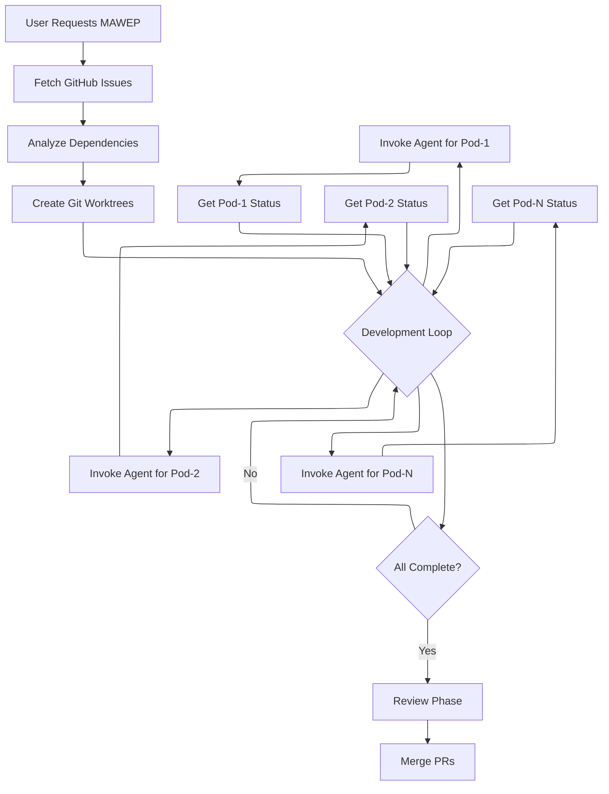
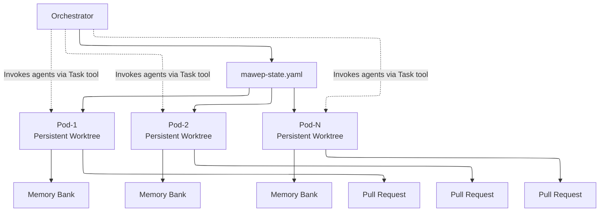
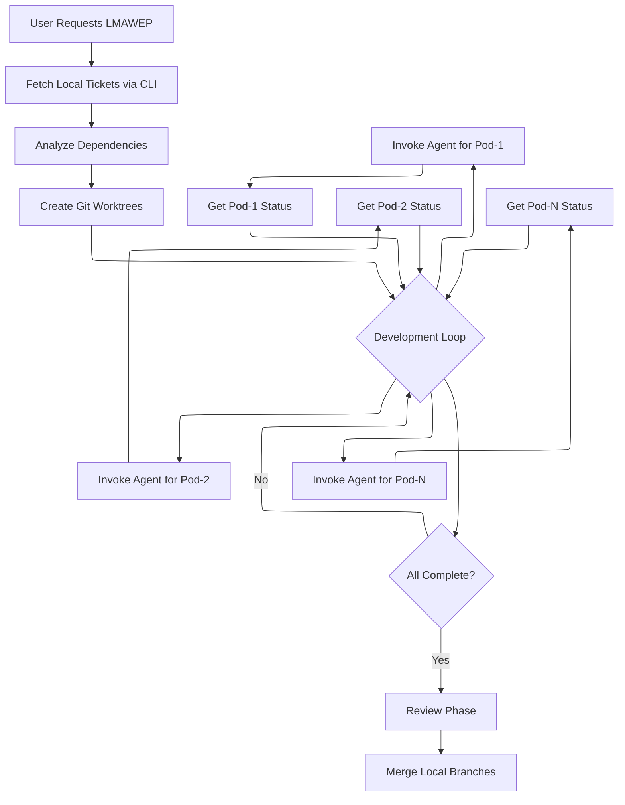

# Prompt Packs

A collection of sophisticated prompt-based modules for Claude Code that enable advanced development patterns without requiring external infrastructure.

**Version:** 0.2.1

## Overview

Prompt Packs provides ready-to-use prompt modules that extend Claude Code's capabilities through carefully engineered prompts and workflows. Each pack is a self-contained module that leverages Claude Code's native tools to achieve complex orchestration patterns.

## Critical Concepts

**Before you start, understand these key facts:**
1. **No Background Work** - The Task tool executes once and stops. There are no background processes.
2. **Continuous Orchestration Required** - You must invoke agents every 30-60 seconds or work halts completely.
3. **Pods vs Agents** - Pods are persistent workspaces (git worktrees), agents are one-time Task tool invocations.
4. **You Are the Engine** - Without your active orchestration, nothing happens.

## Quick Start

### Which Framework Should I Use?

| Your Situation | Use This | Why |
|----------------|----------|-----|
| Working with GitHub issues | **MAWEP** | Direct GitHub integration via `gh` CLI |
| No internet/GitHub access | **LMAWEP** | Completely local ticket system |
| Security-sensitive project | **LMAWEP** | All data stays on your machine |
| Open source collaboration | **MAWEP** | PR-based workflow |
| Not sure | **MAWEP** | More common use case |

### 30-Second Setup
1. Copy the pack: `cp -r mawep ~/.claude/prompt-packs/` (or `lmawep` for local)
2. Add import to `~/.claude/CLAUDE.md`:
   ```
   ## Multi-Agent Workflows
   For parallel development, see: @prompt-packs/mawep/CLAUDE.md
   ```
3. Tell Claude Code: "Act as MAWEP Orchestrator for issues #101, #102, #103"

### What Happens Next
1. Claude analyzes issue dependencies
2. Creates isolated workspaces (pods) for parallel work  
3. You invoke agents to work in pods (every 30-60 seconds)
4. Agents report progress, you coordinate
5. When complete, review and merge PRs

## Prerequisites

### For MAWEP (GitHub Edition)
- Claude Code (latest version recommended)
- Git with GitHub access
- GitHub CLI (`gh`) installed and authenticated 
- Repository with issues to work on

### For LMAWEP (Local-Only Workflow)
- Claude Code (latest version recommended)
- Git (any version)
- Local project directory
- Basic CLI familiarity

## Available Packs

### MAWEP - Multi-Agent Workflow Execution Process

MAWEP enables parallel AI development using only Claude Code's built-in Task tool. It coordinates multiple development pods (persistent git worktrees) where AI agents work on GitHub issues simultaneously without requiring any external infrastructure.

### LMAWEP - Local Multi-Agent Workflow Execution Process

LMAWEP brings the same powerful orchestration as MAWEP but runs entirely local - perfect for air-gapped environments, secure development, or when you need complete control over your development environment. Agents coordinate via local tickets without any external dependencies.

#### What MAWEP Does

- **Parallel Development**: Coordinate multiple AI agents working in persistent pods
- **GitHub Integration**: Direct GitHub issues and PR management
- **Dependency Management**: Automatically sequences work based on issue dependencies
- **Quality Gates**: Built-in review processes with architectural and technical reviews
- **State Persistence**: Simple YAML-based state management
- **Clean Isolation**: Each pod has its own git worktree for conflict-free parallel work

#### What LMAWEP Does

- **100% Local Operation**: No internet or external services required
- **File-Based Tickets**: Simple YAML ticket system for work tracking
- **Offline Coordination**: Agents work via local CLI tool
- **Air-Gap Safe**: Perfect for secure or isolated development environments
- **Zero Dependencies**: Just Claude Code and local files
- **Complete Control**: All code and data remain on your machine

#### How MAWEP Works

> Note: The diagram below uses Mermaid syntax. If it doesn't render, see the text description that follows.



#### Key Concepts

- **Pods**: Persistent git worktrees where work happens
- **Agents**: Ephemeral Task tool invocations that work in pods
- **Orchestrator**: You, managing pods and continuously invoking agents to keep work moving

**Critical Understanding**: Agents are stateless and stop after each invocation. The orchestrator must continuously invoke agents every 30-60 seconds or work stops completely. Pods provide the persistent workspace and context.

#### Architecture



#### How LMAWEP Works




#### MAWEP Usage

To start MAWEP orchestration:

```
I want you to act as the MAWEP Orchestrator for parallel GitHub development.

Repository: [your-org/your-repo]
Issues: #101, #102, #103, #104

Follow the orchestrator instructions in orchestrator-prompt.md
```

#### LMAWEP Usage

To start LMAWEP orchestration:

```
I want you to act as the LMAWEP Orchestrator for parallel local development.

Project: /path/to/your-project
Tickets: 101, 102, 103, 104

Follow the orchestrator instructions in lmawep/framework/prompts/orchestrator-prompt.md
```

#### When to Use MAWEP

- Working with GitHub repositories
- Implementing 3+ related GitHub issues
- Team development with PR reviews
- Open source projects or collaborative workflows

#### When to Use LMAWEP

- Air-gapped development environments
- Security-sensitive projects
- Offline development sprints
- Local prototyping and experimentation
- Any scenario where code must stay local

## Installation & Setup

1. Clone or copy the desired prompt pack
2. Place it in your Claude directory (global or project-specific)
3. Add the pack reference to your CLAUDE.md file

### Setup Options

#### Option 1: Global Installation
```bash
# Copy both packs to your global Claude directory
cp -r mawep ~/.claude/prompt-packs/
cp -r lmawep ~/.claude/prompt-packs/

# Add to ~/.claude/CLAUDE.md:
## Multi-Agent Workflows (MAWEP - GitHub Edition)
For GitHub-integrated parallel development workflows, see: @prompt-packs/mawep/CLAUDE.md

## Multi-Agent Workflows (LMAWEP - Local Command & Control)
For local-only parallel development workflows, see: @prompt-packs/lmawep/CLAUDE.md
```

#### Option 2: Project-Specific Installation
```bash
# Copy both packs to your project (or just the one you need!)
cp -r mawep /path/to/your-project/.claude/prompt-packs/
cp -r lmawep /path/to/your-project/.claude/prompt-packs/

# Add to /path/to/your-project/.claude/CLAUDE.md:
## Multi-Agent Workflows (MAWEP - GitHub Edition)
For GitHub-integrated parallel development workflows, see: @prompt-packs/mawep/CLAUDE.md

## Multi-Agent Workflows (LMAWEP - Local Command & Control)  
For local-only parallel development workflows, see: @prompt-packs/lmawep/CLAUDE.md
```

### Import Reference Tree

Here's how both frameworks organize their documents:

```
📁 ~/.claude/CLAUDE.md (Global Setup)
│   ├── @prompt-packs/mawep/CLAUDE.md (GitHub Edition)
│   └── @prompt-packs/lmawep/CLAUDE.md (Local Command & Control)
│
📁 /your-project/.claude/CLAUDE.md (Project Setup)
│   ├── @prompt-packs/mawep/CLAUDE.md (GitHub Edition)
│   └── @prompt-packs/lmawep/CLAUDE.md (Local Command & Control)
│
📁 mawep/CLAUDE.md (GitHub-integrated workflows)
│   ├── @README.md
│   ├── @framework/prompts/orchestrator-prompt.md
│   ├── @framework/prompts/agent-prompt.md
│   ├── @framework/prompts/technical-reviewer-prompt.md
│   ├── @framework/prompts/architect-reviewer-prompt.md
│   └── @framework/prompts/post-mortem-analyst-prompt.md
│
📁 lmawep/CLAUDE.md (Local-only workflows)
│   ├── @README.md
│   ├── @lmawep-overview.md
│   ├── @lmawep-ticket-system.md
│   ├── @LMAWEP-QUICKSTART.md
│   ├── @framework/prompts/orchestrator-prompt.md (Local edition)
│   ├── @framework/prompts/agent-prompt.md (Local edition)
│   └── @lmawep (CLI executable for ticket management)
```

### Critical: Maintaining Portability

When copying prompt packs:
1. **All @ references within the pack are relative** - ensures portability
2. **No absolute paths inside packs** - keeps them location-independent
3. **The only absolute path should be in your CLAUDE.md import** - for your specific setup

### Required CLAUDE.md Lines

Add these lines to your CLAUDE.md:

```markdown
## Multi-Agent Workflows (MAWEP - GitHub Edition)
For GitHub-integrated parallel development workflows, see: @prompt-packs/mawep/CLAUDE.md

## Multi-Agent Workflows (LMAWEP - Local Command & Control)  
For local-only parallel development workflows, see: @prompt-packs/lmawep/CLAUDE.md
```

**Note**: The @ symbol is required for proper import resolution.

## Common Misconceptions

### ❌ "I'll spawn agents and they'll work in the background"
**Reality**: Agents execute once per invocation and stop. Nothing happens between invocations.

### ❌ "The framework automates everything"
**Reality**: You must actively orchestrate. The framework provides structure, not automation.

### ❌ "Agents can coordinate with each other"
**Reality**: All coordination goes through you, the orchestrator. Agents cannot communicate directly.

### ❌ "I can set it up and walk away"
**Reality**: Continuous attention required. Think of it as conducting an orchestra, not launching a rocket.

## Repository Structure

```
prompt-packs/
├── README.md           # This file
├── CHANGELOG.md        # Version history
├── LICENSE             # MIT License
├── mawep/              # MAWEP pack (GitHub edition)
│   ├── README.md       # MAWEP documentation
│   ├── CLAUDE.md       # Main import file
│   ├── framework/      # Core framework files
│   │   └── prompts/    # Agent prompt templates
│   └── ...
└── lmawep/             # LMAWEP pack (local command & control)
    ├── README.md       # LMAWEP documentation
    ├── CLAUDE.md       # Main import file
    ├── lmawep-overview.md
    ├── lmawep-ticket-system.md
    ├── LMAWEP-QUICKSTART.md
    ├── lmawep          # CLI executable for ticket management (chmod +x required)
    ├── framework/      # Core framework files
    │   └── prompts/    # Agent prompt templates (local edition)
    └── ...
```

## Contributing

When adding new prompt packs:
1. Create a new directory for your pack
2. Include comprehensive documentation
3. Provide example usage scenarios
4. Update this README.md

## License

MIT License - see LICENSE file for details.

## Version History

See CHANGELOG.md for detailed version history.

## Getting Help

- **Framework Issues**: Check the individual pack documentation first
- **Conceptual Questions**: Review the "Common Misconceptions" section above
- **Bug Reports**: Open an issue with specific details about what went wrong

Remember: Success with these frameworks requires understanding that you're the orchestrator, not a passenger. The frameworks provide structure and patterns, but you provide the continuous coordination that makes parallel development possible.