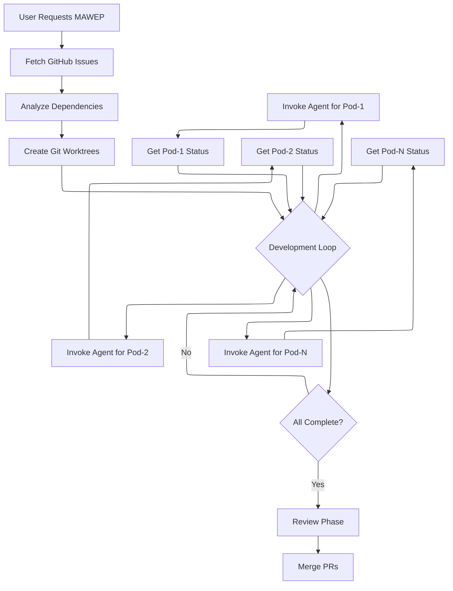
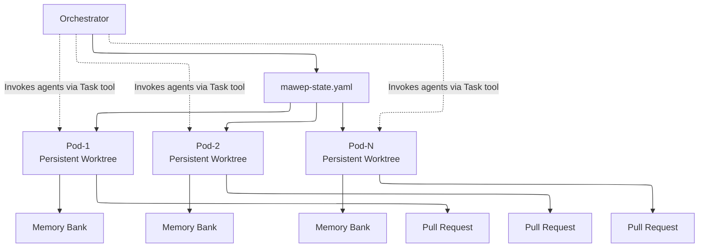
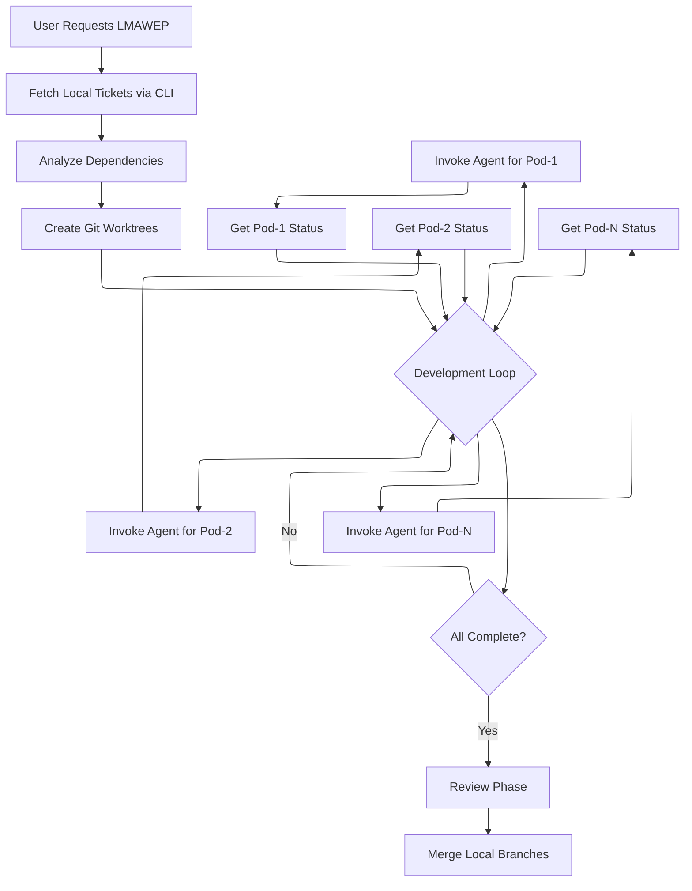

# Prompt Packs 🎮

*"The only winning move is to play... in parallel!"* - A collection of sophisticated prompt-based modules for Claude Code that enable advanced development patterns without requiring external infrastructure.

**Version:** 0.1.0

## Overview

Prompt Packs provides ready-to-use prompt modules that extend Claude Code's capabilities through carefully engineered prompts and workflows. Each pack is a self-contained module that leverages Claude Code's native tools to achieve complex orchestration patterns. Think of it as your DeLorean for development - no plutonium required!

## Quick Start 🏃‍♂️

**Need GitHub integration?** → Use **MAWEP**  
**Need local-only development?** → Use **LMAWEP**  
**Not sure?** → Start with MAWEP if you have GitHub access

### 30-Second Setup
1. Copy the pack: `cp -r [mawep|lmawep] ~/.claude/prompt-packs/`
2. Add import to `~/.claude/CLAUDE.md` (see Installation section)  
3. Start orchestrating: Use the usage examples below

## Prerequisites 🛠️

### For MAWEP (GitHub Edition)
- Claude Code (latest version recommended)
- Git with GitHub access
- GitHub CLI (`gh`) installed and authenticated 
- Repository with issues to work on

### For LMAWEP (Local Command & Control)
- Claude Code (latest version recommended)
- Git (any version)
- Local project directory
- Basic CLI familiarity (you got this, like riding a bike!)

## Available Packs

### MAWEP - Multi-Agent Workflow Execution Process 🤖

*"I need your clothes, your boots, and your GitHub issues."* MAWEP enables parallel AI development using only Claude Code's built-in Task tool. It coordinates multiple development pods (persistent git worktrees) where AI agents work on GitHub issues simultaneously without requiring any external infrastructure. No fate but what we make!

### LMAWEP - Local Multi-Agent Workflow Execution Process 🔒

*"Keep your friends close, your code closer, and your development completely offline!"* LMAWEP brings the same powerful orchestration as MAWEP but runs entirely local - perfect for air-gapped environments, secure development, or when you want that sweet, sweet control. Think of it as your underground development bunker where agents coordinate via local tickets without ever calling home! MacGyver would be proud.

#### What MAWEP Does (It's Got the Power!)

- **Parallel Development**: Coordinate multiple AI agents working in persistent pods like you're assembling the A-Team
- **GitHub Integration**: Direct GitHub issues and PR management - slicker than Miami Vice
- **Dependency Management**: Automatically sequences work - smoother than Magnum P.I.'s mustache
- **Quality Gates**: Built-in review processes tougher than the Kobra Kai dojo
- **State Persistence**: Simple YAML-based state management (no flux capacitor required)
- **Clean Isolation**: Each pod has its own git worktree where agents work - "Nobody puts Baby in a corner!"

#### What LMAWEP Does (Going Full Commando!)

- **100% Local Operation**: No internet required - more secure than NORAD's War Room
- **File-Based Tickets**: YAML ticket system that's simpler than Knight Rider's controls
- **Offline Coordination**: Agents work via local CLI - like having your own underground resistance network
- **Air-Gap Safe**: Perfect for classified projects or when you don't trust the cloud (smart move, Ferris!)
- **Zero Dependencies**: Just you, Claude Code, and local files - minimal as a Zen master
- **Complete Control**: Your code never leaves your machine - Fort Knox-level security

#### How MAWEP Works (GitHub Style)



#### Key Concepts 🔑

- **Pods**: Persistent git worktrees where work happens (like offices that stay open)
- **Agents**: Ephemeral Task tool invocations that work IN pods (like phone calls - they connect, deliver a message, then hang up)
- **Orchestrator**: You, managing pods and continuously invoking agents to keep work moving

Remember: Agents are temporary workers summoned to work in persistent pod workspaces!

#### Architecture



#### How LMAWEP Works (Local Command & Control)




#### MAWEP Usage (The GitHub Connection)

To start MAWEP orchestration:

```
I want you to act as the MAWEP Orchestrator for parallel GitHub development.

Repository: [your-org/your-repo]
Issues: #101, #102, #103, #104

Follow the orchestrator instructions in orchestrator-prompt.md
```

#### LMAWEP Usage (Going Dark)

To start LMAWEP orchestration:

```
I want you to act as the LMAWEP Orchestrator for parallel local development.

Project: /path/to/your-awesome-project
Tickets: 101, 102, 103, 104

Follow the orchestrator instructions in lmawep/framework/prompts/orchestrator-prompt.md
```

#### When to Use MAWEP 📼

- Working with **GitHub repositories** (when you're part of the connected world)
- Implementing 3+ related GitHub issues (like collecting all the Infinity Stones)
- Team development with PR reviews (assembling the A-Team online)
- Open source projects or collaborative workflows (sharing is caring!)

#### When to Use LMAWEP 🔐

- **Air-gapped development** environments (when even KITT can't phone home)
- Security-sensitive projects (more classified than WarGames)
- Offline development sprints (no WiFi, no problem!)
- Local prototyping and experimentation (your own private arcade)
- Any scenario where code must stay local (Fort Knox-level security)

## Installation & Setup 🚀

### "Where we're going, we don't need roads!" - But we do need imports!

1. Clone or copy the desired prompt pack
2. Place it in your Claude directory (global or project-specific)
3. Add the pack reference to your CLAUDE.md file

### Setup Options (Choose Your Fighter!) 🎮

#### Option 1: Global Installation (Like Installing on the C: Drive)
```bash
# Copy both packs to your global Claude directory
cp -r mawep ~/.claude/prompt-packs/
cp -r lmawep ~/.claude/prompt-packs/

# Add to ~/.claude/CLAUDE.md:
## Multi-Agent Workflows (MAWEP - GitHub Edition)
For GitHub-integrated parallel development workflows, see: @prompt-packs/mawep/CLAUDE.md

## Multi-Agent Workflows (LMAWEP - Local Command & Control)
For local-only parallel development workflows, see: @prompt-packs/lmawep/CLAUDE.md
```

#### Option 2: Project-Specific Installation (Keep It Local, Like Your Arcade)
```bash
# Copy both packs to your project (or just the one you need!)
cp -r mawep /path/to/your-project/.claude/prompt-packs/
cp -r lmawep /path/to/your-project/.claude/prompt-packs/

# Add to /path/to/your-project/.claude/CLAUDE.md:
## Multi-Agent Workflows (MAWEP - GitHub Edition)
For GitHub-integrated parallel development workflows, see: @prompt-packs/mawep/CLAUDE.md

## Multi-Agent Workflows (LMAWEP - Local Command & Control)  
For local-only parallel development workflows, see: @prompt-packs/lmawep/CLAUDE.md
```

### Import Reference Tree 🌳

Here's how both frameworks organize their documents (totally modular, dude!):

```
📁 ~/.claude/CLAUDE.md (Global Setup)
│   ├── @prompt-packs/mawep/CLAUDE.md (GitHub Edition)
│   └── @prompt-packs/lmawep/CLAUDE.md (Local Command & Control)
│
📁 /your-project/.claude/CLAUDE.md (Project Setup)
│   ├── @prompt-packs/mawep/CLAUDE.md (GitHub Edition)
│   └── @prompt-packs/lmawep/CLAUDE.md (Local Command & Control)
│
📁 mawep/CLAUDE.md (GitHub-integrated workflows)
│   ├── @README.md
│   ├── @framework/prompts/orchestrator-prompt.md
│   ├── @framework/prompts/agent-prompt.md
│   ├── @framework/prompts/technical-reviewer-prompt.md
│   ├── @framework/prompts/architect-reviewer-prompt.md
│   └── @framework/prompts/post-mortem-analyst-prompt.md
│
📁 lmawep/CLAUDE.md (Local-only workflows)
│   ├── @README.md
│   ├── @lmawep-overview.md
│   ├── @lmawep-ticket-system.md
│   ├── @LMAWEP-QUICKSTART.md
│   ├── @framework/prompts/orchestrator-prompt.md (Local edition)
│   ├── @framework/prompts/agent-prompt.md (Local edition)
│   └── @lmawep (CLI executable for ticket management)
```

### ⚠️ Critical: Maintaining Portability (No DRM Here!)

When copying prompt packs:
1. **All @ references within the pack are relative** - they work like mixtape track listings
2. **No absolute paths inside packs** - keeps them portable like a Walkman
3. **The only absolute path should be in your CLAUDE.md import** - that's your directory's "Play" button

### The Magic Lines ✨

Add these lines to your CLAUDE.md (choose the one you need, or use both for maximum power!):

```markdown
## Multi-Agent Workflows (MAWEP - GitHub Edition)
For GitHub-integrated parallel development workflows, see: @prompt-packs/mawep/CLAUDE.md

## Multi-Agent Workflows (LMAWEP - Local Command & Control)  
For local-only parallel development workflows, see: @prompt-packs/lmawep/CLAUDE.md
```

**Don't forget the @ symbol!** It's like the flux capacitor - without it, nothing works!

## Repository Structure

```
prompt-packs/
├── README.md           # This file - your guide to the galaxy
├── CHANGELOG.md        # Version history
├── LICENSE             # MIT License
├── mawep/              # MAWEP pack (GitHub edition)
│   ├── README.md       # MAWEP documentation
│   ├── CLAUDE.md       # Main import file
│   ├── framework/      # Core framework files
│   │   └── prompts/    # Agent prompt templates
│   └── ...
└── lmawep/             # LMAWEP pack (local command & control)
    ├── README.md       # LMAWEP documentation
    ├── CLAUDE.md       # Main import file
    ├── lmawep-overview.md
    ├── lmawep-ticket-system.md
    ├── LMAWEP-QUICKSTART.md
    ├── lmawep          # CLI executable for ticket management (chmod +x required)
    ├── framework/      # Core framework files
    │   └── prompts/    # Agent prompt templates (local edition)
    └── ...
```

## Contributing 🕹️

*"Be excellent to each other!"* When adding new prompt packs:
1. Create a new directory for your pack (name it like an 80s band)
2. Include comprehensive documentation (no instruction manual? Bogus!)
3. Provide example usage scenarios (show us the moves)
4. Update this README.md (keep the legend alive)

## License 📺

MIT License - see LICENSE file for details. *"It's dangerous to go alone! Take this!"*

## Version History 🎬

See CHANGELOG.md for detailed version history. Like tracking John McClane through all the Die Hard movies!