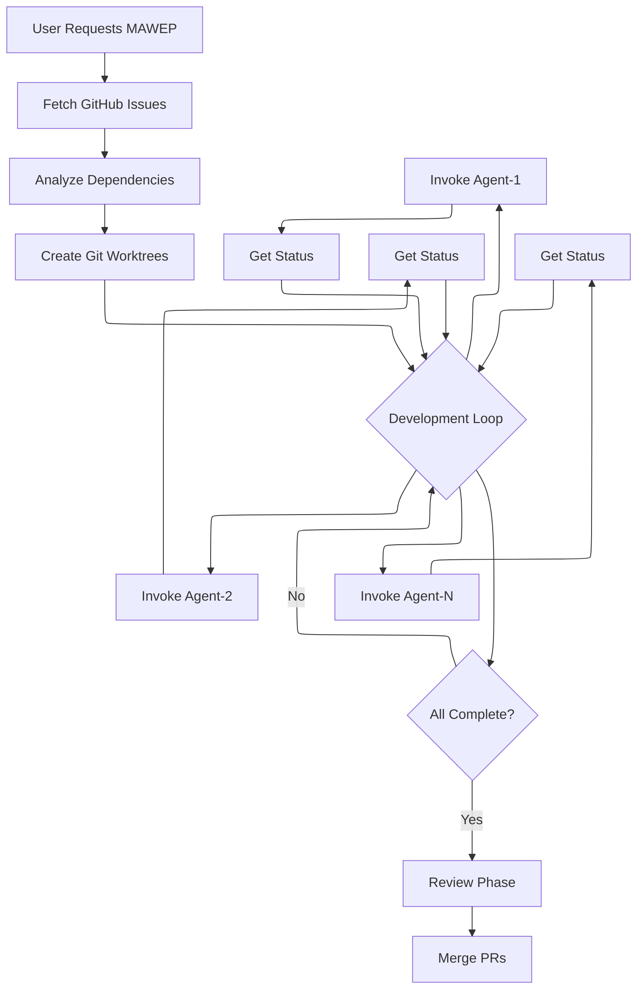
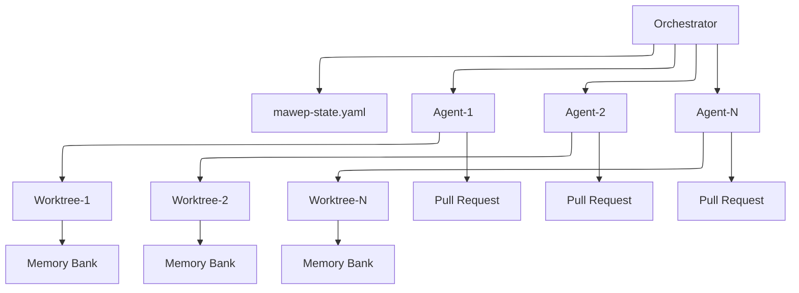
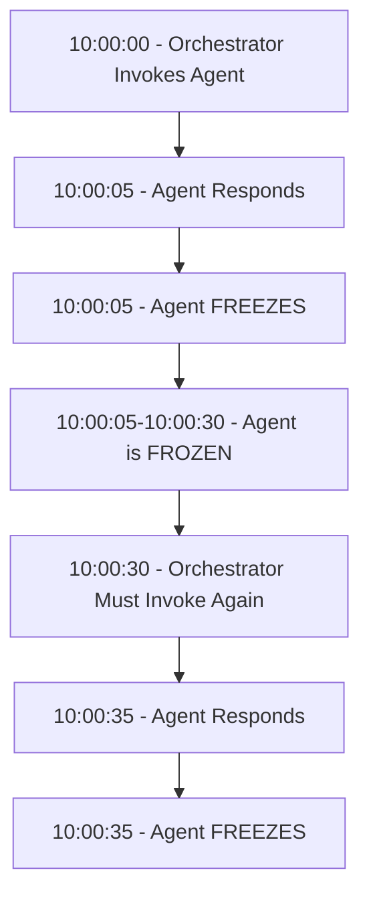

# Prompt Packs

A collection of sophisticated prompt-based modules for Claude Code that enable advanced development patterns without requiring external infrastructure.

**Version:** 0.1.0

## Overview

Prompt Packs provides ready-to-use prompt modules that extend Claude Code's capabilities through carefully engineered prompts and workflows. Each pack is a self-contained module that leverages Claude Code's native tools to achieve complex orchestration patterns.

## Available Packs

### MAWEP - Multi-Agent Workflow Execution Process

MAWEP enables parallel AI agent development using only Claude Code's built-in Task tool. It coordinates 2-10 AI agents working on GitHub issues simultaneously without requiring any external infrastructure.

#### What MAWEP Does

- **Parallel Development**: Spawn multiple AI agents to work on different GitHub issues concurrently
- **Dependency Management**: Automatically sequences work based on issue dependencies
- **Quality Gates**: Built-in technical and architectural review processes
- **State Persistence**: Simple YAML-based state management
- **Clean Isolation**: Each agent works in its own git worktree to prevent conflicts

#### How It Works



#### Architecture



#### Task Tool Reality



**Critical**: Agents do NOT work in the background. They completely freeze after each response and require continuous invocation every 30-60 seconds.

#### Usage

To start MAWEP orchestration:

```
I want you to act as the MAWEP Orchestrator for parallel GitHub development.

Repository: [your-org/your-repo]
Issues: #101, #102, #103, #104

Follow the orchestrator instructions in orchestrator-prompt.md
```

#### When to Use MAWEP

- Implementing 3+ related GitHub issues
- Large refactoring projects
- Feature development with independent components
- Any scenario requiring parallel development

## Installation

1. Clone this repository
2. Each pack is self-contained in its directory
3. Reference the specific prompt files when invoking Claude Code

## Repository Structure

```
prompt-packs/
├── README.md           # This file
├── CHANGELOG.md        # Version history
├── LICENSE             # MIT License
└── mawep/              # MAWEP pack
    ├── README.md       # MAWEP documentation
    ├── framework/      # Core framework files
    │   └── prompts/    # Agent prompt templates
    └── ...
```

## Contributing

When adding new prompt packs:
1. Create a new directory for your pack
2. Include comprehensive documentation
3. Provide example usage scenarios
4. Update this README.md

## License

MIT License - see LICENSE file for details

## Version History

See CHANGELOG.md for detailed version history.