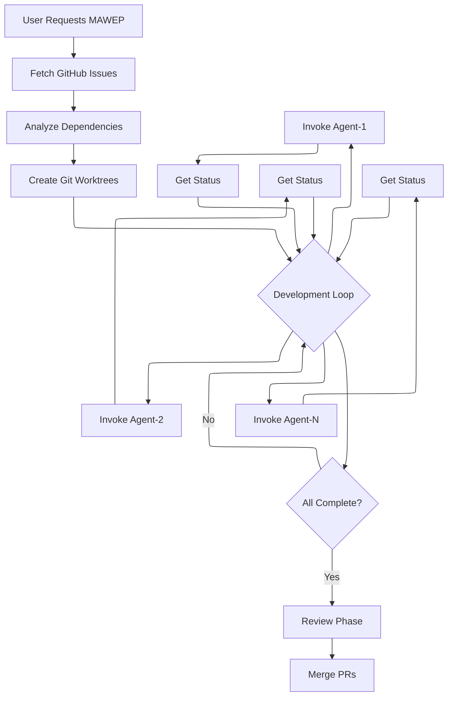
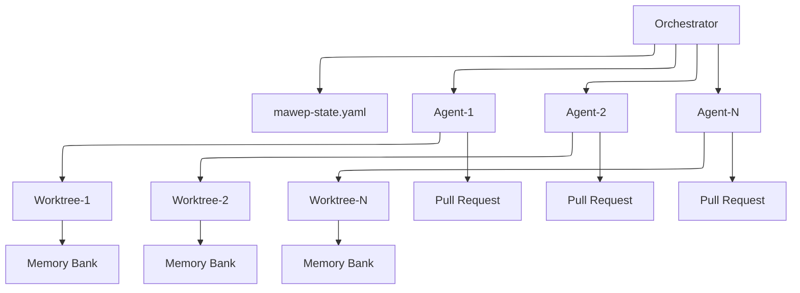

# Prompt Packs 🎮

*"The only winning move is to play... in parallel!"* - A collection of sophisticated prompt-based modules for Claude Code that enable advanced development patterns without requiring external infrastructure.

**Version:** 0.1.0

## Overview

Prompt Packs provides ready-to-use prompt modules that extend Claude Code's capabilities through carefully engineered prompts and workflows. Each pack is a self-contained module that leverages Claude Code's native tools to achieve complex orchestration patterns. Think of it as your DeLorean for development - no plutonium required!

## Available Packs

### MAWEP - Multi-Agent Workflow Execution Process 🤖

*"I need your clothes, your boots, and your GitHub issues."* MAWEP enables parallel AI agent development using only Claude Code's built-in Task tool. It coordinates 2-10 AI agents working on GitHub issues simultaneously without requiring any external infrastructure. No fate but what we make!

#### What MAWEP Does (It's Got the Power!)

- **Parallel Development**: Spawn multiple AI agents like you're assembling the A-Team
- **Dependency Management**: Automatically sequences work - smoother than Magnum P.I.'s mustache
- **Quality Gates**: Built-in review processes tougher than the Kobra Kai dojo
- **State Persistence**: Simple YAML-based state management (no flux capacitor required)
- **Clean Isolation**: Each agent works in its own git worktree - "Nobody puts Baby in a corner!"

#### How It Works



#### Architecture




#### Usage

To start MAWEP orchestration:

```
I want you to act as the MAWEP Orchestrator for parallel GitHub development.

Repository: [your-org/your-repo]
Issues: #101, #102, #103, #104

Follow the orchestrator instructions in orchestrator-prompt.md
```

#### When to Use MAWEP 📼

- Implementing 3+ related GitHub issues (like collecting all the Infinity Stones)
- Large refactoring projects (time to "wax on, wax off" that codebase)
- Feature development with independent components (Voltron-style assembly)
- Any scenario requiring parallel development (because life moves pretty fast)

## Installation & Setup 🚀

### "Where we're going, we don't need roads!" - But we do need imports!

1. Clone this repository
2. Each pack is self-contained in its directory
3. Add the pack reference to your CLAUDE.md file (global or project)

### Import Reference Tree

Here's how the MAWEP documents reference each other (it's like a choose-your-own-adventure book!):

```
📁 ~/.claude/CLAUDE.md (Global)
│   └── @~/.claude/docs/prompt-packs/mawep/CLAUDE.md
│
📁 /your-project/CLAUDE.md (Project-specific)
│   └── @~/.claude/docs/prompt-packs/mawep/CLAUDE.md
│
📁 mawep/CLAUDE.md
    ├── @orchestrator-prompt.md
    ├── @agent-prompt.md
    ├── @technical-reviewer-prompt.md
    ├── @architect-reviewer-prompt.md
    └── @post-mortem-analyst-prompt.md
```

### The Magic Line ✨

Add this line to your global or project CLAUDE.md to enable MAWEP:

```markdown
## Multi-Agent Workflows (MAWEP)
For multi-agent parallel development workflows, see: @~/.claude/docs/prompt-packs/mawep/CLAUDE.md
```

**Don't forget the @ symbol!** It's like the flux capacitor - without it, nothing works!

## Repository Structure

```
prompt-packs/
├── README.md           # This file
├── CHANGELOG.md        # Version history
├── LICENSE             # MIT License
└── mawep/              # MAWEP pack
    ├── README.md       # MAWEP documentation
    ├── framework/      # Core framework files
    │   └── prompts/    # Agent prompt templates
    └── ...
```

## Contributing 🕹️

*"Be excellent to each other!"* When adding new prompt packs:
1. Create a new directory for your pack (name it like an 80s band)
2. Include comprehensive documentation (no instruction manual? Bogus!)
3. Provide example usage scenarios (show us the moves)
4. Update this README.md (keep the legend alive)

## License 📺

MIT License - see LICENSE file for details. *"It's dangerous to go alone! Take this!"*

## Version History 🎬

See CHANGELOG.md for detailed version history. Like tracking John McClane through all the Die Hard movies!